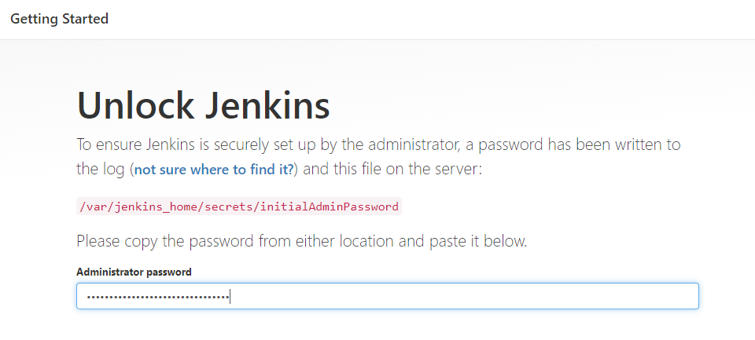

# JenkinsOnDocker
docker-compose for Jenkisn and Docker running on Windows


### first run
```
docker-compose up -d
docker exec -it <container name> bash
cat /var/jenkins_home/secrets/initialAdminPassword
```
Go to **localhost:8080** and paste string from initialAdminPassword file.


